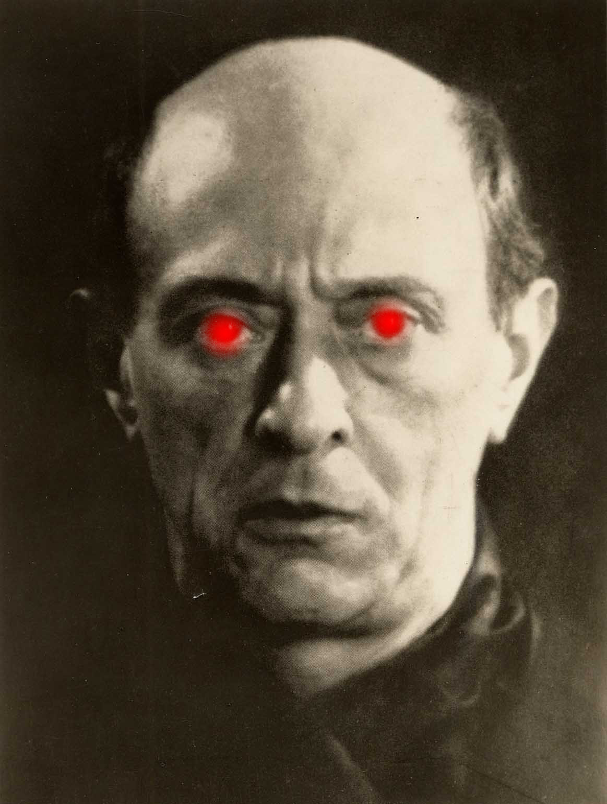

[](https://ko-fi.com/X8X6RXV10)


# Harmonic Toolkit for SuperCollider

 

This SuperCollider package makes it simple and practical to work with harmony theory without having to know harmony theory.

It simplifies thinking around harmony, arpeggiation, chords and intervals to make it easier to compose music based on harmonic thinking. 

A harmony in the context of this toolkit is simply an array of semi tone offsets (or midinotes). These can then be transformed using conventional harmonic operations like doubling (adding octaves above or below) or inversions of the root notes of the chords. 

See the help files for more information.

## Installation

Open up SuperCollider and evaluate the following line of code:
`Quarks.install("https://github.com/madskjeldgaard/harmonics")`

## Examples

### Simple

A simple example of how to create a harmony and perform operations on it using inversions and doublings.

```supercollider
(
// Can be initialized with a chord name
var h = Harmony.new(\major7);

// Or a list of semitone offsets
// var h = Harmony.new([0, 5, 9]);

// See the semitones of the chord
"Before operations: %".format(h.value).postln;

// Perform inversion
h.addInversion(patternType: \first, style: \up);
"After inversion operations: %".format(h.value).postln;

// Clear the inversion if you fancy
// h.clearInversion();

// Perform doubling
h.addDouble(patternType: \root,  octaves: -2);
"After doubling operations: %".format(h.value).postln;
)
```

### Patterns

All of these pattern examples use the `\ctranspose` key in Pbind to transpose each midi note using one of the harmonies chosen. This is neat because then you can write a melody in either `\degree` or `\midinote` and keep that melody seperate from your harmony.

```supercollider
// Simple chord progression
(
Pbind(
	\degree, Prand([0,2,4,5], inf),
    \ctranspose, Pn(PIntervalArp(\major)),
    \dur, 0.5
).play;
)

// Complex arpeggiation
(
Pbind(
    \ctranspose, PIntervalArp(
        [\major, \minor7, \diminished],
        [\blossomup, \updown, \random]
    ),
    \dur, 0.125
).play;
)

// Combining with other patterns
(
Pbind(
    \ctranspose, Pseq([

        // Major chord
        PIntervalArp(\major),

        // Major 9
        PIntervalArp(\major9),

        // Major 9 with chord operations
        PIntervalArp(Harmony(\major9).withDouble(\root, octaves: -1).withInversion(\first))
    ], inf).trace,
    \dur, 0.25
).play;
)
)
```

#### Ambient machine

```supercollider
(
// A synth to play notes
SynthDef.new(\ambientNote, {
    arg freq=440, amp=0.1, gate=1, dur=1, cutoff=450, resonance=0.75, attack=0.5, sustainLevel=0.95, decay=0.4, release=0.5, pan=0;
    var env = EnvGen.ar(Env.adsr(attackTime: attack, decayTime: decay,sustainLevel: sustainLevel, releaseTime: release), gate: gate, timeScale: dur, doneAction:2);
    var sig = BlitB3Saw.ar(freq);

    sig = DFM1.ar(sig, cutoff, resonance);

    sig = Pan2.ar(sig, pan);
    Out.ar(0, sig * amp * env);
}).add;

// A reverb to make it washy
SynthDef.new(\jpverb, {
    arg in, xfade=0.5, predelay=0.1, revtime=42.0, damp=0.01, room=5;
    var dry = In.ar(in, 2);
    var sig = JPverb.ar(in: dry, t60: revtime, damp: damp, size: room);

    XOut.ar(0, xfade, sig);
}).add;
)

// Harmonize a random melody with minor 7th chords with octave doublings for that thick, ambient sound.
(
var chordName = 'minor7';
var harmony = chordName.asHarmony.withDouble(octaves: -2);
var numNotes = harmony.value.size;

Pdef(\ambienty,
    Pbind(
        \instrument, \ambientNote,
        \octave, 5,
        \scale, Scale.minor,
        \degree, Pwhite(-5,5,inf),
        \ctranspose, harmony,
        \dur, 32.0,
        \pan, Pwhite(-1.0,1.0,inf).clump(numNotes),
        \legato, 1.05
    )
).play;
)

// Add some swishy swashy reverb
Synth.after(1, \jpverb)
```

